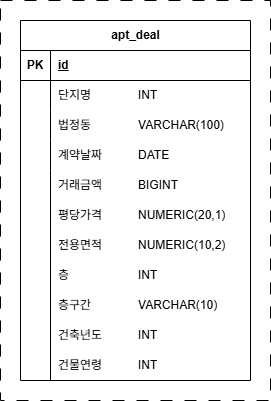

# 서울 종로구 아파트 매매 실거래가 데이터 저장 시스템

| 파일명 | 설명 |
| --- | --- |
| `models.py` | SQLAlchemy 테이블 모델 정의 |
| `database.py` | DB 연결과 테이블 생성 |
| `loader.py` | CSV 적재 |
| `verify.py` | 검증. 대상 테이블을 정확히 조사 |
| `pipeline.py` | 통합 실행 |
| `README.md` | 실행 방법과 설계 설명 |

---
## pgAdmin에서 데이터베이스 준비
```sql
CREATE DATABASE aptapidb;
```

---
## 입력 파일 준비

| 폴더 | 필요한 파일 |
| --- | --- |
| `fastapi/storage_apt/input/` | `apt_deal.csv` |

---
- 결과로 나온 파일 `apt_deal.csv`를 사용
- CSV 인코딩은 `utf-8-sig` 기준

---
## ERD
