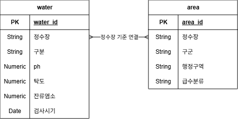

# 연도별 수질검사 기록 저장 시스템

---
## 파일 설명
| 파일명 | 설명 |
| --- | --- |
| `README.md` | 설계 설명과 실행 방법 |
| `models.py` | SQLAlchemy 테이블 모델 정의 |
| `database.py` | DB 연결과 테이블 생성 |
| `loader.py` | CSV 적재 |
| `verify.py` | 검증 |
| `pipeline.py` | 통합 실행 |
---
## 입력 파일 준비
| 폴더 | 필요한 파일 |
| --- | --- |
| `TEST/08_빅데이터저장시스템개발_김동욱/input/` | `/water.csv` |
| `TEST/08_빅데이터저장시스템개발_김동욱/input/` | `/area.csv` |
---
- CSV 인코딩은 `utf-8-sig` 기준
---
### pgAdmin에서 데이터베이스 준비
```sql
CREATE DATABASE water_DB;
```
---
## 실행 방법
---
PgAdmin에서 DB(`water_DB`)를 생성한 후 `pipeline.py` 파일 실행

---
## water 정보

| 컬럼명 | 자료형 | 설명 |
| --- | --- | --- |
| `water_id` | Integer | 대리키 |
| `정수장` | String(10) | 정수장명 |
| `구분` | String(10) | 정수장 구분 |
| `ph` | Numeric(5,2) | pH농도 |
| `탁도` | Numeric(5,2) | 탁도 |
| `잔류염소` | Numeric(5,2) | 잔류염소 |
| `검사시기` | Date | 검사 연-월-일(일은 1로 고정) |

UNIQUE 제약 : `정수장 + 구분 + 검사시기` (`uq_water_key`)
---
## area 정보
| 컬럼명 | 자료형 | 설명 |
| --- | --- | --- |
| `area_id` | Integer | 대리키 |
| `정수장` | String(10) | 정수장명 |
| `구군` | String(10) | 구/군 이름 |
| `행정구역` | String(10) | 행정동 이름 |
| `급수분류` | String(10) | 전지역 / 일부지역 |

UNIQUE 제약 : `정수장 + 구군 + 행정구역 + 급수분류` (`uq_area_key`)
---
### 테이블 관계


water 테이블의 정수장 컬럼과 area 테이블의 정수장 컬럼이 같다.

area 테이블에서 행정구역마다 어느 정수장에서 물이 공급되는지 확인할 수 있고,  
water 테이블에서 정수장마다 2025년 매월 수질 검사 결과를 알 수 있다.

정수장과 행정구역의 관계는 N:M 관계이다.  
하나의 정수장에서 여러 행정구역에 물을 급수하고, 2개 이상의 정수장에서 하나의 행정구역으로 물을 공급하기도 한다.

---
## 중복 방지 전략

`Water`, `Area` 모두 UNIQUE 제약을 걸어두었다.  
PostgreSQL의 `ON CONFLICT` 기능을 사용하여 중복을 방지했다.

---
## 검증

- 완전성 검증
- NULL 검증
- 이상치 검증
---
### 완전성 검증
water.csv, area.csv와 PgAdmin의 DB에 저장된 행 수가 일치하는지 확인

---
### NULL 검증
필수 컬럼(`NOT NULL`)에 실제로 빈 값이 있는지 확인

---
### 이상치 검증
먹는 물 수질 기준으로 식수에 적합한지 확인  
pH : 5.8 ~ 8.5  
탁도 : 0.5 NTU 이하  
잔류염소 : 0.1 ~ 4.0 mg/L

---

### 데이터 조회의 한계

`area` 테이블은 행정구역별 정수장 이름만 확인할 수 있다.
`water` 테이블에서는 정수장 중에서 구분으로 정수1, 정수2로 나눠지는 정수장이 있다.

두 테이블을 `정수장`으로 JOIN 했을 때, 행정구역별 정수1, 정수2를 구분할 수 없다.

---
