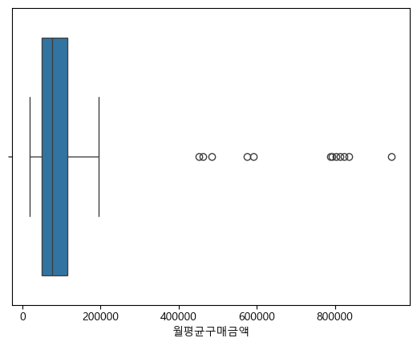

# 분석데이터전처리

## 0. 라이블러리 불러오기

- 라이브러리 불러오기
```python
import numpy as np
import pandas as pd
import matplotlib.pyplot as plt
import seaborn as sns
from sklearn.preprocessing import StandardScaler
from sklearn.preprocessing import LabelEncoder
```

- 깨짐 방지
```python
plt.rcParams["font.family"] = "Malgun Gothic"
plt.rcParams["axes.unicode_minus"] = False
```

---

## 1. 데이터 불러오기 및 결측치 처리

- 데이터 불러오기 및 형태 확인
```python
df = pd.read_csv("./files/prj_data.csv")

df.shape
```
(500, 12)

500행, 12열  
500개 샘플, 12개 컬럼 


- 컬럼별 결측치 수량 확인
```python
df.isnull().sum()
```
고객ID         0  
나이          40  
성별          15  
거주지역         0  
가입경로        20  
멤버십등급        0  
월평균구매금액      0  
구매횟수         0  
리뷰점수        25  
쿠폰사용여부       0  
메모         284  
이탈여부         0  
dtype: int64  

---

### 결측치 비율 50% 초과 컬럼 삭제하기

- 컬럼별 결측치 비율 확인 및 결측치 비율 50% 초과 컬럼 확인
```python
df.isnull().mean()
```
고객ID       0.000  
나이         0.080  
성별         0.030  
거주지역       0.000  
가입경로       0.040  
멤버십등급      0.000  
월평균구매금액    0.000  
구매횟수       0.000  
리뷰점수       0.050  
쿠폰사용여부     0.000  
<span style="color:red"><b>메모         0.568</b></span>  
이탈여부       0.000  
dtype: float64  

메모 컬럼이 결측치 비율 50% 초과


- 결측치 비율 50% 초과 컬럼(메모) 삭제하기
```python
drop_cols = missing_ratio[missing_ratio > 0.5].index.tolist()

df = df.drop(columns=drop_cols)
```

---

### 수치형 컬럼의 결측치 처리

- 수치형 컬럼의 결측치 처리
```python
num_cols_na = df.select_dtypes(include="number").columns 
num_cols_na = num_cols_na[df[num_cols_na].isnull().any()]
num_cols_na
```
Index(['나이', '리뷰점수'], dtype='str')

- 결측치가 있는 수치형 컬럼의 평균과 중앙값 확인
```python
df[num_cols_na].agg(["mean", "median"])
```
| | 나이 | 리뷰점수 |
|:---:|:---:|:---:|
| mean | 43.195652 | 3.736632 |
| median | 43.000000 | 3.700000 |

"나이", "리뷰점수" 두 컬럼 모두 평균과 중앙값이 거의 비슷한 값이지만
평균은 반올림이 필요하기 때문에 두 컬럼의 결측치는 중앙값으로 대체한다.

- 수치형 컬럼의 결측치 처리
```python
for c in num_cols_na:
    df[c] = df[c].fillna(df[c].median())
```

---

# 범주형 컬럼의 결측치 처리

- 범주형 컬럼의 결측치 처리
```python
cat_cols_na = df.select_dtypes(exclude="number").columns
cat_cols_na = cat_cols_na[df[cat_cols_na].isnull().any()]
cat_cols_na
```
Index(['성별', '가입경로'], dtype='str')

- 결측치가 있는 범주형 컬럼의 최빈값 확인
```python
df["성별"].value_counts()

df["가입경로"].value_counts()
```
"성별", "가입경로" 두 컬럼의 결측치를 최빈값으로 채운다.

- 범주형 컬럼의 결측치 처리
```python
df["성별"] = df["성별"].fillna(df["성별"].mode()[0])
df["가입경로"] = df["가입경로"].fillna(df["가입경로"].mode()[0])
```

---

### 결측치 처리가 다 되었는지 확인

```python
df.isnull().sum()
```
고객ID       0  
나이         0  
성별         0  
거주지역       0  
가입경로       0  
멤버십등급      0  
월평균구매금액    0  
구매횟수       0  
리뷰점수       0  
쿠폰사용여부     0  
이탈여부       0  
dtype: int64  

---

## 2. 이상치 탐지 및 처리

- 월편균구매금액 컬럼 이상치 시각화!

```python
sns.boxplot(x=df["월평균구매금액"])
plt.show()
```



- 사분위수 활용
```python
q1 = df["월평균구매금액"].quantile(.25)

q3 = df["월평균구매금액"].quantile(.75)

q1, q3
```
(np.float64(48362.456334193215), np.float64(114551.09835296536))


q1 (제1사분위수): 하위 25% 위치의 값  
q3 (제3사분위수): 하위 75% (상위 25%) 위치의 값

- 이상치 결정
```python
iqr = q3 - q1
lower = max(q1 - 1.5 * iqr, 0)
upper = q3 + 1.5 * iqr
```
"월평균구매금액"컬럼이기 때문에 음수는 있을 수 없다.

- 이상치 수량 확인

```python
((df["월평균구매금액"] < lower) | (df["월평균구매금액"] > upper)).sum()
```
np.int64(12)

- 이상치 처리
```python
df = df[df["월평균구매금액"] > lower]

df["월평균구매금액"] = df["월평균구매금액"].clip(upper=upper)
```
이 데이터는 구매고객과 관련된 데이터로 보이므로
"월평균구매금액"이 0 이하라면 구매고객이 아닌 오류로 입력된 값이라고 추정할 수 있다. 따라서 삭제한다.
"월평균구매금액"이 상한을 초과하는 값들은 일부 고객의 극단값이므로 상한으로 맞추어 완하한다.

---
## 3. 범주형 변수 인코딩

---
### 범주형 컬럼 확인

- 범주형 컬럼 확인
```python
df.select_dtypes(exclude="number").columns
```
Index(['고객ID', '성별', '거주지역', '가입경로', '멤버십등급', '쿠폰사용여부'], dtype='str')

---

### 순서가 있는 범주형 컬럼 인코딩하기

- 순서가 있는 범주형 컬럼
```python

membership = LabelEncoder()
membership.fit(df["멤버십등급"])
membership.classes_ = np.array(["브론즈", "실버", "골드", "VIP"])

df["멤버십등급"] = membership.transform(df["멤버십등급"])
```
멤버십등급은 등급의 순서의 의미가 있다고 볼 수 있다.
따라서, 원-핫 인코딩보다 레이블 인코딩이 적합하다.
(브론즈: 0, 실버: 1, 골드: 2, VIP: 3) 으로 인코딩한다.

---

### 순서가 없는 범주형 컬럼 인코딩하기

- 순서가 없는 범주형 컬럼
```python
df = pd.get_dummies(data=df, columns=["성별", "거주지역", "가입경로", "쿠폰사용여부"])
```
멤버십등급을 제외한 나머지 범주형 컬럼들은 순서에 의미가 있다고 보기 어렵다.
따라서 원-핫 인코딩이 더 적합하다.

---

### 데이터프레임 형태 비교

- 데이터프레임 형태 비교

```python
print(f"원본 데이터프레임 형태 : {df_origin.shape[0]}행, {df_origin.shape[1]}열\n")
print(f"결측치 처리 후 인코딩 전 데이터프레임 형태 : {df_null_after.shape[0]}행, {df_null_after.shape[1]}열\n")
print(f"인코딩 후 데이터프레임 형태 : {df.shape[0]}행, {df.shape[1]}열\n")
print(f"{df_origin.shape}, {df_null_after.shape}, {df.shape}")
```
원본 데이터프레임 형태 : 500행, 12열  

결측치 처리 후 인코딩 전 데이터프레임 형태 : 500행, 11열  

인코딩 후 데이터프레임 형태 : 500행, 20열  

(500, 12), (500, 11), (500, 20)

---

## 4. 파생변수 생성 및 스케일링

### 파생변수(평균구매단가) 컬럼 만들기

- 파생변수(평균구매단가) 컬럼 만들기

```python
(df["구매횟수"] == 0).sum()

df["평균구매단가"] = df["월평균구매금액"] / df["구매횟수"]
```
구매횟수 컬럼이 분모가 되므로 분모가 0이되는 값이 있는지 확인 후 평균구매단가 컬럼 만들기

---

### 스케일링 작업이 필요한 컬럼 결정하기

- 스케일링 작업이 필요한 컬럼 결정하기

```python
scale_cols = ["나이", "월평균구매금액", "구매횟수", "리뷰점수",  "평균구매단가"]
```

---

### 스케일링 작업이 필요한 컬럼의 평균과 표준편차 구하기

- 스케일링 작업이 필요한 컬럼의 평균과 표준편차 구하기

```python
df[scale_cols].describe().loc[["mean", "std"]]
```
|  | 나이 | 월평균구매금액 | 구매횟수 | 리뷰점수 | 평균구매단가 |
|:---:|:---:|:---:|:---:|:---:|:---:|
| mean | 43.180000 | 86092.413399 | 7.822000 | 3.734800 | 13129.800389 |
| std | 14.384764 | 47003.366902 | 4.481795 | 0.540382 | 8858.181124 |

---

### 스케일링 작업 - 표준화

- 스케일링 작업이 필요한 컬럼 표준화하기
```python
scaler = StandardScaler()
df[scale_cols] = scaler.fit_transform(df[scale_cols])
```

---

## 5. 전처리 작업 완료 데이터를 csv파일로 저장하기

### csv 파일로 저장
- 저장하기
```python
df.to_csv("./files/prj_data_cleaned.csv", index=False, encoding="utf-8-sig")
```

---

### 저장한 csv파일 열어서 확인하기
- 파일 읽기
```python
pd.read_csv("./files/prj_data_cleaned.csv")
```